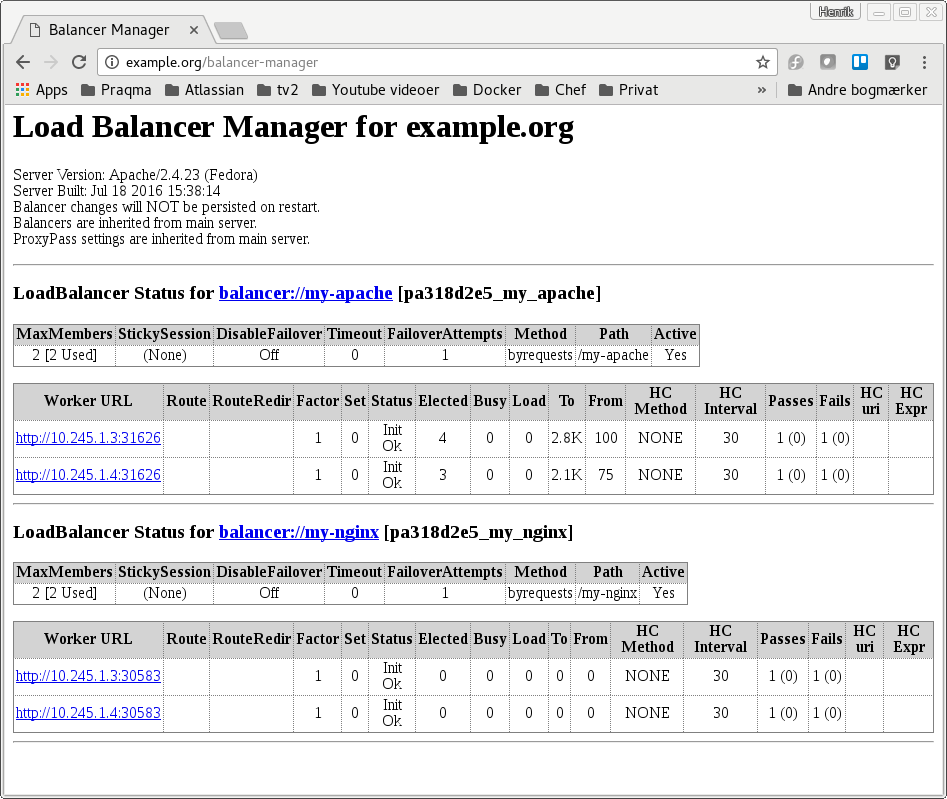

# Kubernetes loadbalancer using NodePort
## In this example we are creating a Deployment with two pods, and a Service that exposes these on every node on the cluster.

If you run the following command, these will be deployed
```
source start-pods.sh
```

Now we need to have Apache installed. Here we have done it on the main host machine.

We now run the following, to add the service to the loadbalancer.

```
source setHttpdConf.sh > httpd-loadbalancer.conf
sudo cp httpd-loadbalancer.conf /etc/httpd/conf.d/
sudo service httpd restart
```

Now go to http://localhost/balancer-manager and you can see the nodes and loadbalancer status.
I you have more services/Deployments, you can run the script again, and it will add it to Apache.



Now we can see that the path to each service, is its own service name in the cluster.
Eg. localhost/my-apache
