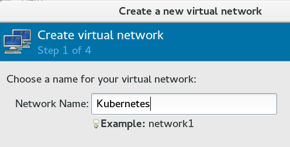
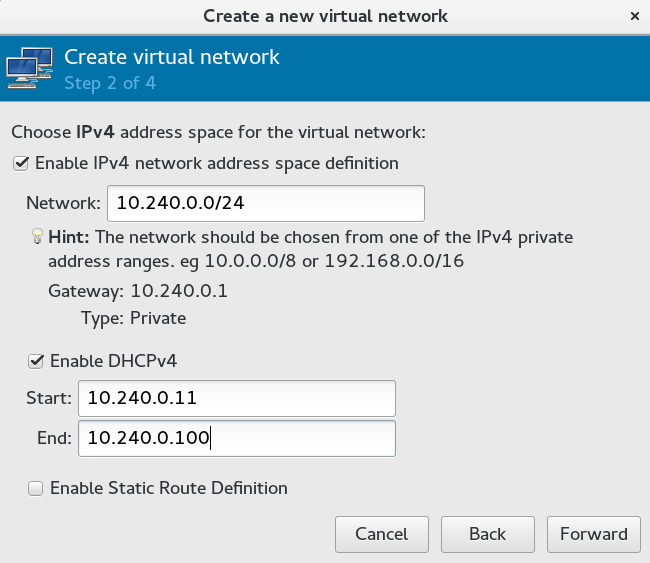
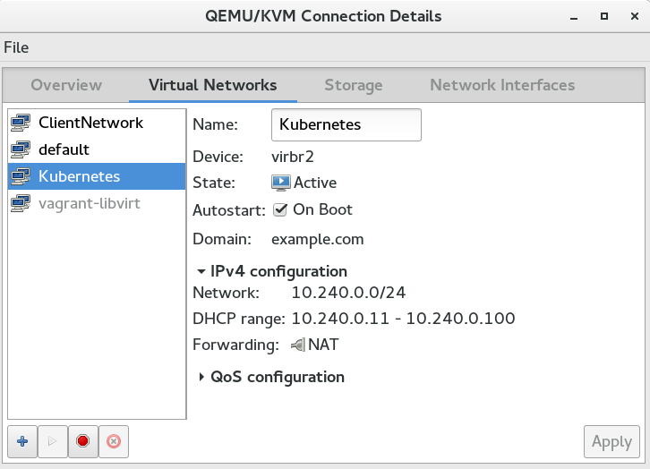

# Kubernetes The Hard Way - Bare Metal

This document is going to be the last document in the series of Kubernetes the Hard Way. It follows Kelsey Hightower's turtorial [https://github.com/kelseyhightower/kubernetes-the-hard-way](https://github.com/kelseyhightower/kubernetes-the-hard-way) , and attempts to make improvements and explanations where needed. So here we go.

# Target Audience
The target audience for this tutorial is someone planning to setup or support a production Kubernetes cluster and wants to understand how everything fits together. 

# Infrastructure:
I do not have actual bare metal. I have vitual machines, running on LibVirt/KVM on my work computer (Fedora 23 - 64 bit). Some may argue that I could have used Amazon AWS, and used VMs over there too. Well, I tried that , documented here: [Kubernetes-The-Hard-Way-on-AWS.md](Kubernetes-The-Hard-Way-on-AWS.md) , and it did not work when I reached Pod Networking on worker nodes. Amazon has it's VPC mechanism, and it did not let the traffic flow between two pod networks on two different worker nodes. May be I did not know how to get that done correctly, but this type of routing on AWS VPC is not documented either. So I had to abandon it. 


So, I am going to use VMs on my work computer to create this setup. But before I start building VMs, I want to mention few important things.

## Networking:
Kubernetes uses three different types of networks. They are:

* Infrastructure Network: The network your physical (or virtual) machines are connected to. Normally your production network, or a part of it.
* Service Network: The (completely) virtual (rather fictional) network, which is used to assign IP addresses to Kubernetes Services, which you will be creating. (A Service is a frontend to a RC or a Deployment). It must be noted that IP from this network are **never** assigned to any of the interfaces of any of the nodes/VMs, etc. These (Service IPs) are used behind the scenes by kube-proxy to create (weird) iptables rules on the worker nodes. 
* Pod Network: This is the network, which is used by the pods. However it is not a simple network either, depending on what kubernetes network solution you are employing. If you are using flannel, then this would be a large software defined overlay network, and each worker node will get a subnet of this network and configured for it's docker0 interface (in very simple words, there is a little more to it). If you are employing CIDR network, using CNI, then it would be a large network called **cluster-cidr** , with small subnets corresponding to your worker nodes. The routing table of the router handling your part of infrastructure network will need to be updated with routes to these small subnets. This proved to be a challenge on AWS VPC router, but this is piece of cake on a simple/generic router in your network. I will be doing it on my work computer, and setting up routes on Linux is a very simple task.

Kelsey used the following three networks in his guide, and I intend to use the same ones, so people following this guide, but checking his guide for reference are not confused in different IP schemes. So here are my three networks , which I will use for this guide.

* Infrastructure network:     10.240.0.0/24 
* Service Network:            10.32.0.0/24 
* Pod Network (Cluster CIDR): 10.200.0.0/16 


By default I have a virtual network 192.168.124.0/24 configured on my work computer, provided by libvirt. However, I want to be as close to Kelsey's guide as possible, so my infrastructure network is going to be 10.240.0.0/24 . I will just create a new virtual network (10.240.0.0/24) on my work computer.


The setup will look like this when finished:

(TODO) A network diagram here.


## DNS names:
It is understood that all nodes in this cluster will have some hostname assigned to them. It is important to have consistent hostnames, and if there is a DNS server in your infrastructure, then it is also important what are the reverse lookup names of these nodes. This information is  critical at the time when you will generate SSL certificates. 


## Operating System:
Fedora 24 64 bit server edition - on all nodes (Download from [here](https://getfedora.org/en/server/download/) ). Even though I wanted to use Fedora Atomic, I am not using that. It is because Fedora Atomic is a collection of binaries bundled together (in a read only  filesystem), and individual packages cannot be updated. There is no yum, etc. I am going to use latest version of Kubernetes 1.3, which is still not part of Fedora Atomic. 

# Expectations

A working kubernetes cluster with:
* 2 x etcd nodes (in H/A configuration) 
* 2 x Kubernetes controller nodes (in H/A configuration) 
* 2 x Kubernetes worker nodes
* SSL based communication between all Kubernetes components
* Internal Cluster DNS (SkyDNS) - as cluster addon
* Default Service accounts and Secrets


# Supporting software needed for this setup:
* Kubernetes - 1.3.0 or later (Download latest from Kubernetes website)
* etcd - 2.2.5 or later (The one that comes with Fedora is good enough)
* Docker - 1.11.2 or later (Download latest from Docker website)
* CNI networking [https://github.com/containernetworking/cni](https://github.com/containernetworking/cni)


# Infrastructure provisioning

Note that I am doing this provisioning on my work computer, which is Fedora 23 64 bit, and I will use the built in (the best) KVM for virtualization. 

First, setting up the new infrastructure network in KVM.

## Setup new virtual network in KVM:

Start Virtual Machine Manager and go to "Edit"->"Connection Details"->"Virtual Networks" . Then follow the steps shown below to create a new virtual network. Note that this is a NAT network, connected to any/all physical devices on my computer. So whether I am connected to wired network, or wireless, it will work.








The wizard will create an internal DNS setup (automatically) for example.com .

Now, we have the network out of the way, I will start creating VMs and attach them to this virtual network.

## Provision VMs in KVM:

Here are the sizes (and related IP addresses) of VMs I am creating:

etcd1		512 MB RAM	4 GB disk	10.240.0.11/24
etcd2		512 MB RAM	4 GB disk	10.240.0.12/24
controller1	1 GB RAM	4 GB disk	10.240.0.21/24
controller2	1 GB RAM	4 GB disk	10.240.0.22/24
worker1		1.5 GB RAM	20 GB disk	10.240.0.31/24
worker2		1.5 GB RAM	20 GB disk	10.240.0.32/24

**Notes:** 
* Kelsey's guide starts the node numbering from 0. I start them from 1, for ease of understanding.
* The FQDN of each host is *hostname*.example.com 
* The nodes have only one user, **root** ; password: redhat .
* I used GUI interface to create these VMs, but you can automate this by using CLI commands.


I have added a few screenshots, so people new to KVM have no problem doing this.
**Note:** One of the installation screen shows Fedora 22 on Installation Media selection screen, but it is actually Fedora 24. Libvirt is not updated yet to be aware of Fedora 24 images.

(TODO) Screenshots from fedora installation.

(TODO) Screenshot showing admin (web) interface (Cockpit) when logged in on login screen.


After all VMs are created. I do an OS update on them using `yum -y update`, disable firewalld service, and also disable SELINUX in `/etc/selinux/config` file and reboot all nodes for these changes to take effect. 

Though not absolutely necessary, I also installed my RSA (SSH) public key to root account of all nodes, so I can ssh into them without password.

```
[kamran@kworkhorse ~]$ ssh-copy-id root@10.240.0.11
The authenticity of host '10.240.0.11 (10.240.0.11)' can't be established.
ECDSA key fingerprint is SHA256:FUMy5JNZnaLXhkW3Y0/WlXzQQrjU5IZ8LMOcgBTOiLU.
ECDSA key fingerprint is MD5:5e:9b:2d:ae:8e:16:7a:ee:ca:de:de:da:9a:04:19:8b.
Are you sure you want to continue connecting (yes/no)? yes
/usr/bin/ssh-copy-id: INFO: attempting to log in with the new key(s), to filter out any that are already installed
/usr/bin/ssh-copy-id: INFO: 2 key(s) remain to be installed -- if you are prompted now it is to install the new keys
root@10.240.0.11's password: 

Number of key(s) added: 2

Now try logging into the machine, with:   "ssh 'root@10.240.0.11'"
and check to make sure that only the key(s) you wanted were added.

[kamran@kworkhorse ~]$ 
```

You should be able to execute commands on the nodes now:
```
[kamran@kworkhorse ~]$ ssh root@10.240.0.11 uptime
 13:16:27 up  1:29,  1 user,  load average: 0.08, 0.03, 0.04
[kamran@kworkhorse ~]$ 
```

I also updated my /etc/hosts on my work computer:
```
[kamran@kworkhorse ~]$ sudo vi /etc/hosts
127.0.0.1               localhost.localdomain localhost
10.240.0.11     etcd1.example.com       etcd1
10.240.0.12     etcd2.example.com       etcd2
10.240.0.21     controller1.example.com controller1
10.240.0.22     controller2.example.com controller2
10.240.0.31     worker1.example.com     worker1
10.240.0.32     worker2.example.com     worker2
```


And, copied the same to all nodes.
```
[kamran@kworkhorse ~]$ scp /etc/hosts root@etcd1:/etc/hosts 
[kamran@kworkhorse ~]$ scp /etc/hosts root@etcd2:/etc/hosts 
[kamran@kworkhorse ~]$ scp /etc/hosts root@controller1:/etc/hosts 
[kamran@kworkhorse ~]$ scp /etc/hosts root@controller2:/etc/hosts 
[kamran@kworkhorse ~]$ scp /etc/hosts root@worker1:/etc/hosts 
[kamran@kworkhorse ~]$ scp /etc/hosts root@worker2:/etc/hosts 
```

Disable firewall on all nodes.
```
\# service firewalld stop; systemctl disable firewalld
```


Disable SELINUX on all nodes:

```
\# vi /etc/selinux/config

SELINUX=disabled
SELINUXTYPE=targeted 
```

OS update on all nodes, and reboot:
```
\# yum -y update ; reboot
```


