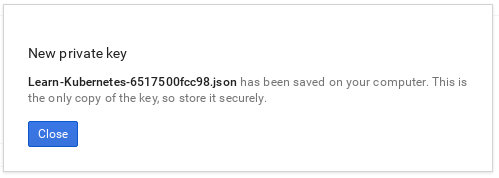
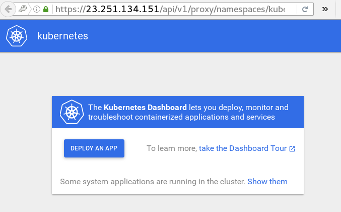

# Kubernetes on Google Container Engine 

This document discusses and explores the setup of two web servers running in a GCE. One web server is Nginx and the other is Apache. We want to see how this is setup and how traffic reaches the containers from outside.


# Install necessary software on your dev computer:

Note: In this document, the dev computer is the one named **kworkhorse** .

## Prerequisits: 
Install gcloud and kubectl on local computer, using instructions from this link: [https://cloud.google.com/container-engine/docs/before-you-begin](https://cloud.google.com/container-engine/docs/before-you-begin) .

Also:
* Enable Billing for your account,
* Enable Container Engine API
* Create authentication keys:




In case you already have the software installed, it is good idea to update the gcloud components. 
```
[kamran@kworkhorse ~]$  sudo /opt/google-cloud-sdk/bin/gcloud components update 
```

## Create new project in google cloud: 
Create a new project on GCE, using: [https://console.cloud.google.com/project](https://console.cloud.google.com/project)

Note: Project cannot be created through gcloud command. Though you can list projects using the gcloud command:

```
[kamran@kworkhorse ~]$ gcloud  projects  list
PROJECT_ID             NAME              PROJECT_NUMBER
learn-kubernetes-1289  Learn-Kubernetes  185358700664
[kamran@kworkhorse ~]$ 


[kamran@kworkhorse ~]$ gcloud  projects  describe  learn-kubernetes-1289 
createTime: '2016-04-22T08:44:46.593Z'
lifecycleState: ACTIVE
name: Learn-Kubernetes
projectId: learn-kubernetes-1289
projectNumber: '185358700664'
[kamran@kworkhorse ~]$ 
``` 


We see that the project ID of the new project is learn-kubernetes-1289 .

Setup the config for gcloud on your dev computer:
```
gcloud config set project learn-kubernetes-1289
gcloud config set compute/zone europe-west1-b
``` 

Notes: 
* Compute Zones are found here: [https://cloud.google.com/compute/docs/zones#available](https://cloud.google.com/compute/docs/zones#available)
* Machine types are here: [https://cloud.google.com/compute/docs/machine-types](https://cloud.google.com/compute/docs/machine-types) 
* Container Engine (Kubernetes) (shows cluster and cluster size, container registry): [https://console.cloud.google.com/kubernetes](https://console.cloud.google.com/kubernetes)
* Compute Engine (shows VM Instances,CPU usage, Disks, Images, Zones, etc): [https://console.cloud.google.com/compute](https://console.cloud.google.com/compute) 


## View/verify gcloud defaults:
```
[kamran@kworkhorse LearnKubernetes]$ gcloud config list
Your active configuration is: [default]

[compute]
zone = europe-west1-b
[core]
account = kamranazeem@gmail.com
disable_usage_reporting = False
project = learn-kubernetes-1289
[kamran@kworkhorse LearnKubernetes]$
```

## Create a new cluster:


``` 
[kamran@kworkhorse LearnKubernetes]$ gcloud container clusters create test-twowebservers  --num-nodes 1  --machine-type g1-small
Creating cluster test-twowebservers...done.
Created [https://container.googleapis.com/v1/projects/learn-kubernetes-1289/zones/europe-west1-b/clusters/test-twowebservers].
kubeconfig entry generated for test-twowebservers.
NAME                ZONE            MASTER_VERSION  MASTER_IP       MACHINE_TYPE  NODE_VERSION  NUM_NODES  STATUS
test-twowebservers  europe-west1-b  1.2.4           23.251.134.151  g1-small      1.2.4         1          RUNNING
[kamran@kworkhorse LearnKubernetes]$ 
``` 

You will see the same information when you login to the GCE web UI.


You now have one instance in this project - the worker node that you specified. The kubernetes master, which takes care of pod scheduling and runs the Kubernetes API server, is hosted by Container Engine.

You can visit the Kubernetes web UI by visiting the master IP from the information from  `clusters list` command. [https://MASTER_IP/ui](https://MASTER_IP/ui)

Needs username and password! See below:

```
[kamran@kworkhorse LearnKubernetes]$ gcloud container clusters get-credentials test-twowebservers
Fetching cluster endpoint and auth data.
kubeconfig entry generated for test-twowebservers.
[kamran@kworkhorse LearnKubernetes]$ 
```


Then you do a "kubectl config view" to display the credentials stored in the config:

```
[kamran@kworkhorse LearnKubernetes]$ kubectl config view --cluster="test-twowebservers"
apiVersion: v1
clusters:
- cluster:
    server: http://192.168.1.81:8080
  name: cluster81
- cluster:
    server: http://192.168.124.50:8080
  name: fedora-multinode
- cluster:
    certificate-authority-data: REDACTED
    server: https://23.251.134.151
  name: gke_learn-kubernetes-1289_europe-west1-b_test-twowebservers
contexts:
- context:
    cluster: cluster81
    user: ""
  name: cluster81
- context:
    cluster: fedora-multinode
    user: ""
  name: fedora-multinode
- context:
    cluster: gke_learn-kubernetes-1289_europe-west1-b_test-twowebservers
    user: gke_learn-kubernetes-1289_europe-west1-b_test-twowebservers
  name: gke_learn-kubernetes-1289_europe-west1-b_test-twowebservers
current-context: gke_learn-kubernetes-1289_europe-west1-b_test-twowebservers
kind: Config
preferences: {}
users:
- name: gke_learn-kubernetes-1289_europe-west1-b_test-twowebservers
  user:
    client-certificate-data: REDACTED
    client-key-data: REDACTED
    password: gGHfYmATGh02YxIE
    username: admin
[kamran@kworkhorse LearnKubernetes]$ 
```
There are several clusters in the output above, you can safely ignore the ones you are not concerned with.

Now use the username and password displayed at the bottom of the output from above and login to **https://MASTER_IP/ui** . After logging in a freshly created cluster, you will see something like this:

---

---


